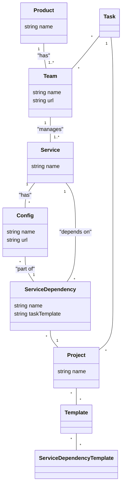

# System Component Relationship Visualizer

This project is a proof-of-concept for a system that models and visualizes the relationships between various components in a software ecosystem. It is designed to serve as an alternative to Backstage.io, with a focus on tracking deployment plans and dependencies across different teams and products.

For detailed setup and usage instructions, please see the [**Quick Start Guide**](./QUICK_START.md).

## Core Concepts

The system is designed to represent the real-world relationships between software components developed by different teams. It distinguishes between three types of relationships:

-   **Internal:** A component delivered by the same team.
-   **Product:** A component delivered by another team within the same product.
-   **Company:** A component delivered by a team from a different product.

## Architecture

The system is built on a modern, cloud-native architecture, using the following key technologies:

-   **Technology:** Python
-   **Communication:** gRPC
-   **Database:** PostgreSQL
-   **Local Development:** Tilt on Kubernetes
-   **Future Integrations:**
    -   Keycloak for authentication
    -   OpenTelemetry and Prometheus for observability
    -   JIRA for task integration

## System Model

The relationship between the core components of the system is illustrated below:

This diagram shows the main entities of the system, such as `Product`, `Team`, `Service`, and how they relate to each other. For a detailed description of each class, please refer to the original [project description](./project_description.md).