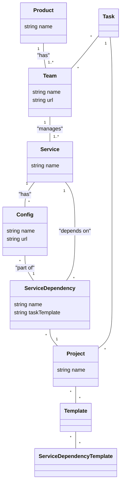

### This document is prerequisit for project. POC will be fully generated with AI tools

# General assumptions

* Use Dependency Injection to prevent strong coupling
* Technology Python
* Database PostgreSQL
* Application will be integrated with Keycloak
* Opentelemetry
* Tasks created in JIRA
* gRPC communication
* Prometheus metrics

# Backstage.io system alternative focused on deployment plan for project

Our system is responsible for presenting real-world relations between system components. Due the fact that system consists of components provided by various product teams we distinguish 3 types of relations:
Internal - if component is delivered by team itself
Product - if related component is delivered by another team within the same product
Company - if related service is delivered by another product team

## Class Descriptions

### Product

Represents a collection of teams and the services they manage. It serves as the top-level organizational unit within the company's product structure. A single product can contain one or more teams.

### Team

A group of individuals responsible for developing and maintaining a set of services. Each team belongs to a specific product. A team can manage one or more services. The system uses the team affiliation to determine Internal relations, where a component is delivered by the same team.

### Service

A core component of the system. Services are the tangible units that have configurations and dependencies. They are managed by a specific team. Services form the basis for all relation types: Internal, Product, and Company.

### Config

Represents the dedicated configuration settings for a specific service. A service can have multiple configurations, each tailored for different environments or use cases. The configuration is directly related to a service.

### ServiceDependency

This class models a real-world relation between services. It's a critical component for visualizing the system's architecture. A ServiceDependency links two or more services and is part of a Project. This class also incorporates the Config information related to the dependency, such as a service's specific configuration when it connects to another.

### Project

Represents a specific initiative or application that utilizes a collection of services and their dependencies. A project organizes a set of ServiceDependency instances to reflect a complete deployment or solution. This class provides the context for how services are connected in a given scenario.

### Template

This class defines a blueprint for a project or a set of services. A template contains general requirements or function descriptions, such as "full access control." By using a template, you can automate the creation of a complex set of ServiceDependency instances. A template can be used across multiple projects to ensure consistency and efficiency.

### ServiceDependencyTemplate

This class is a building block for a Template. It defines a predefined service dependency, including the services involved and their required configurations. For example, a ServiceDependencyTemplate for "full access control" might include a dependency between services like Keycloak, OPA, and OPAL. When a template is used, these predefined ServiceDependencyTemplates are instantiated, potentially with extra parameters, to build the full service dependency graph for a project.

### Task

Class defines task which could be link to JIRA, email notification for specific team etc.
